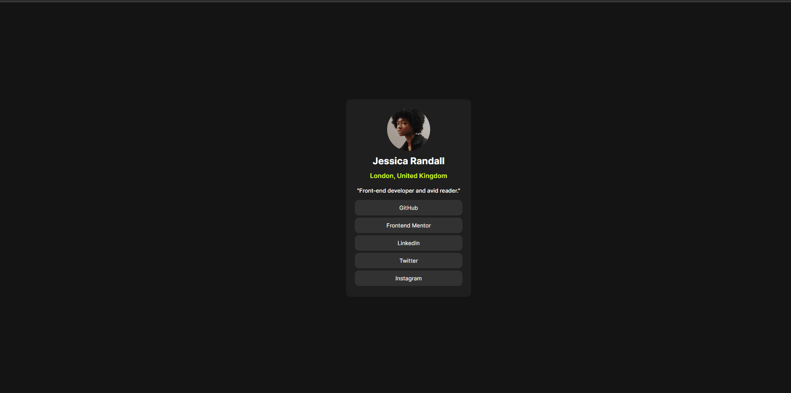

# Frontend Mentor - Social Link Profile solution

Esta é uma solução para o [Social links profile no Frontend Mentor](https://www.frontendmentor.io/challenges/social-links-profile-UG32l9m6dQ). Os desafios do Frontend Mentor ajudam você a melhorar suas habilidades de codificação através da construção de projetos realistas.

## Índice

- [Visão geral](#visão-geral)
  - [O desafio](#o-desafio)
  - [Captura de tela](#captura-de-tela)
  - [Links](#links)
- [Meu processo](#meu-processo)
  - [Construído com](#construído-com)
  - [O que aprendi](#o-que-aprendi)
  - [Autor](#autor)
- [Agradecimentos](#agradecimentos)

## Visão geral

### O desafio

Seu desafio é construir esse perfil de links sociais e fazer com que pareça o mais próximo possível do design.

Você pode usar qualquer ferramenta que desejar para ajudá-lo a completar o desafio. Então, se você tem algo que gostaria de praticar, sinta-se à vontade para tentar.

### Captura de tela

### Links

- URL da solução: [Adicione o URL da solução aqui](https://github.com/LuizFernandoFagundes/social_link)
- URL do site ativo: [Adicione o URL do site ativo aqui](https://luizfernandofagundes.github.io/social_link/)

## Meu processo
- Primeiro passo, foi criar uma estrutura em HTML, utilizando um container para envolver todo o conteudo.
- Logo após a criação da estrutura, foi feito a utilização de CSS3 para dar o estilo. 
### Construído com

- Marcação HTML5 semântica
- Propriedades personalizadas CSS
- Caixa flexível

## Autor

- Site - [Luiz Fernando](https://www.seu-site.com)
- Mentor de Frontend - [@Luizfernando](https://www.frontendmentor.io/profile/LuizFernandoFagundes)

## Agradecimentos

Gostaria de agradecer aos professores do curso devQuest, e ao incrivél time de suporte, sem eles não seria possível a conclusão desse desafio.
Com o conteudo muito bem explicado e com as aulas extremamente incriveis, pude chegar até aqui.
Quero expressar minha sincera gratidão por todo o apoio e incentivo que vocês tem me dado.
